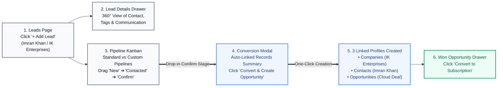
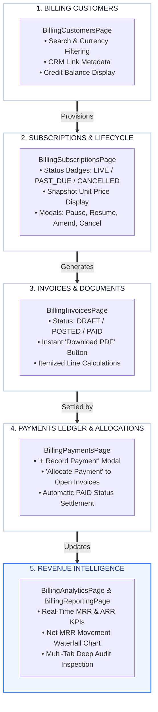

# AdaptCRM Frontend — Single-Page Application (SPA)

[](https://react.dev/)
[](https://vitejs.dev/)
[](https://lucide.dev/)
[](https://stripe.com/)
[-brightgreen.svg)]()

This repository contains the authoritative React single-page application for **AdaptCRM**, integrating the **CRM Sales Workspace**, the **Job Tracking System (JTS) Client Portal**, and the **Standalone Commercial Billing Suite** under a unified, multi-tenant interface with dynamic Role-Based Access Control (RBAC).

---

## 📑 Table of Contents
- [1. User Interface Architecture Diagrams](#1-user-interface-architecture-diagrams)
  - [1.1 Complete Ecosystem & Portal Routing](#11-complete-ecosystem--portal-routing)
  - [1.2 CRM Sales Pipeline & Deal Conversion UI Flow](#12-crm-sales-pipeline--deal-conversion-ui-flow)
  - [1.3 Standalone Billing & Revenue Analytics UI Flow](#13-standalone-billing--revenue-analytics-ui-flow)
- [2. Feature Modules & Page Inventory](#2-feature-modules--page-inventory)
- [3. Dynamic RBAC Navigation & Permission Guards](#3-dynamic-rbac-navigation--permission-guards)
- [4. Dedicated Billing API Adapter (`billingApi.js`)](#4-dedicated-billing-api-adapter-billingapijs)
- [5. Installation & Quickstart](#5-installation--quickstart)
- [6. Directory Structure](#6-directory-structure)

---

## 1. User Interface Architecture Diagrams

### 1.1 Complete Ecosystem & Portal Routing
This diagram visualizes how the frontend routes authenticated users between the **CRM Sales Workspace**, **JTS Client Portal**, and **Executive Admin Suite**:

```mermaid
flowchart TD
    LOGIN["Authentication Screen (LoginPage)<br/>• Session Recovery &bull; Password Reset"]
    AUTH_CHECK{"User Identity & Role"}

    subgraph JtsClientSection ["1. JTS Client Portal (src/jts/)"]
        JTS_LAND["Public Service Landing"]
        JTS_REG["Org Registration & CNIC Verification"]
        JTS_DASH["User Dashboard (Job Tracking)"]
        JTS_ADMIN["JTS Admin Fulfillment"]
        JTS_LAND --> JTS_REG
        JTS_REG --> JTS_DASH
        JTS_DASH <--> JTS_ADMIN
    end

    subgraph CrmSalesSection ["2. CRM Workspace (src/pages/)"]
        CRM_DASH["Sales Dashboard"]
        LEADS["Leads & Details Drawers"]
        PIPE["Pipeline Kanban Board"]
        ACCTS["Companies & Contacts"]
        OPPS["Opportunities Management"]
        LEADS --> PIPE
        PIPE --> ACCTS
        ACCTS --> OPPS
    end

    subgraph BillingSection ["3. Standalone Billing Suite"]
        BCUST["Billing Customers"]
        BSUB["Subscriptions & Lifecycle"]
        BINV["Invoices & PDF Export"]
        BPAY["Payments Ledger & Allocation"]
        BREP["Revenue Analytics"]
        BCUST --> BSUB
        BSUB --> BINV
        BINV --> BPAY
        BPAY --> BREP
    end

    subgraph AdminSection ["4. Admin Management"]
        UREP["User Performance Reporting"]
        ROLES["Roles & Permissions Matrix"]
        USERS["Employee Directory"]
    end

    LOGIN --> AUTH_CHECK
    AUTH_CHECK -->|JTS Org Owner| JTS_DASH
    AUTH_CHECK -->|Sales Representative| CRM_DASH
    AUTH_CHECK -->|Commercial Manager| BCUST
    AUTH_CHECK -->|CRM Administrator| ROLES

    JTS_DASH <==|Domain Switcher Button| CRM_DASH
    OPPS ==>|Convert to Subscription| BCUST
    ROLES -.->|Configures 5 Granular Permissions| BSUB

    classDef authStyle fill:#1e1b4b,stroke:#6366f1,stroke-width:2px,color:#ffffff;
    classDef jtsStyle fill:#fef3c7,stroke:#d97706,stroke-width:2px,color:#78350f;
    classDef crmStyle fill:#f0f9ff,stroke:#0284c7,stroke-width:2px,color:#0c4a6e;
    classDef billStyle fill:#fdf4ff,stroke:#a855f7,stroke-width:2px,color:#581c87;
    classDef adminStyle fill:#ecfdf5,stroke:#059669,stroke-width:2px,color:#065f46;

    class LOGIN,AUTH_CHECK authStyle;
    class JTS_LAND,JTS_REG,JTS_DASH,JTS_ADMIN jtsStyle;
    class CRM_DASH,LEADS,PIPE,ACCTS,OPPS crmStyle;
    class BCUST,BSUB,BINV,BPAY,BREP billStyle;
    class UREP,ROLES,USERS adminStyle;
```

---

### 1.2 CRM Sales Pipeline & Deal Conversion UI Flow
This diagram illustrates the user-side journey from lead creation to the 3-profile conversion modal and won deal hand-off:



---

### 1.3 Standalone Billing & Revenue Analytics UI Flow
This diagram details the commercial interface across customers, subscriptions, invoices, and payments:



---

## 2. Feature Modules & Page Inventory

### CRM Domain
- **Dashboard (`Dashboard`)**: Command center with 3-filter bar (Pipeline, Salesperson, Date Range), top KPI cards, activity feed, and team leaderboards.
- **Leads (`LeadsPage.jsx`)**: Inbound inquiry directory, filtering by status/source/owner, and slide-over Lead Details Drawer.
- **Pipeline (`PipelinePage.jsx`)**: Drag-and-drop Kanban board supporting **Standard Pipeline** and **Custom Pipelines**, stage reordering, and the auto-link **Lead Conversion Modal**.
- **Companies (`CompaniesPage.jsx`)**: Organizational account profiles with linked contacts and deals.
- **Contacts (`ContactsPage.jsx`)**: Stakeholder directory with direct phone, email, and company associations.
- **Opportunities (`OpportunitiesPage.jsx`)**: Commercial deals with stage history, contract scoping, and the `Convert to Subscription` commercial bridge.
- **Legacy Payments (`PaymentsPage.jsx`)**: Project milestone instalment records.

### Standalone Billing Domain
- **Revenue Analytics (`BillingAnalyticsPage.jsx`)**: Real-time MRR, ARR, active subscribers, ARPU, and MRR Waterfall growth breakdown.
- **Billing Customers (`BillingCustomersPage.jsx`)**: Customer directory, currency preferences (USD/PKR), tax identification, and payment terms.
- **Subscriptions (`BillingSubscriptionsPage.jsx`)**: Agreement details, immutable price snapshot inspections, term scheduling, and lifecycle state management (Activate, Pause, Resume, Cancel at Period End).
- **Invoices (`BillingInvoicesPage.jsx`)**: Posted invoice browser, line item subtotals, and 1-click branded PDF invoice downloads.
- **Payments Ledger (`BillingPaymentsPage.jsx`)**: Independent cash records and double-entry payment allocation modal to settle invoices.
- **Billing Reporting (`BillingReportingPage.jsx`)**: Multi-tab executive explorer (Subscriptions, Invoices, Payments, Customers) with audit log inspector and dunning history.

### Security & Administration
- **User Reporting (`UserReportingPage.jsx`)**: Sales team performance tracking, rep win rates, and drill-down audit views.
- **Roles (`RolesPage.jsx`)**: Organizational role management with user counts.
- **Permissions (`PermissionsPage.jsx`)**: Centralized RBAC matrix configuring the **5 independent Billing resources** with `ALL`, `OWN`, and `NONE` scopes.
- **Users (`UsersPage.jsx`)**: Employee management and dynamic role assignment.

---

## 3. Dynamic RBAC Navigation & Permission Guards

The application computes user permissions dynamically upon login (`/api/me/`) and applies strict route guards in `src/App.jsx`:

```javascript
// Dynamic Billing Permission Evaluation
if (pageKey === 'billing-analytics')     return hasPermission('billing_analytics', 'view');
if (pageKey === 'billing-customers')     return hasPermission('billing_customers', 'view');
if (pageKey === 'billing-subscriptions') return hasPermission('billing_subscriptions', 'view');
if (pageKey === 'billing-invoices')      return hasPermission('billing_invoices', 'view');
if (pageKey === 'billing-payments')      return hasPermission('billing_payments', 'view');
```

If an administrator revokes a user's permission (for example, `Invoices -> VIEW`), the module is cleanly removed from the sidebar navigation, and any manual navigation attempt renders the `AccessRestrictedScreen`.

---

## 4. Dedicated Billing API Adapter (`billingApi.js`)

All communication with `/api/v1/billing/` endpoints is encapsulated within `src/utils/billingApi.js`:

```javascript
import { 
  fetchBillingAnalyticsOverview, 
  fetchSubscriptions, 
  transitionSubscription, 
  fetchInvoices, 
  getInvoicePdfUrl, 
  recordPayment, 
  allocatePayment 
} from './utils/billingApi';
```

---

## 5. Installation & Quickstart

### Prerequisites
- **Node.js 18+** or **Node.js 20+**
- **npm 9+** or **pnpm / yarn**

### Step-by-Step Setup

1. **Clone the Repository**:
   ```bash
   git clone https://github.com/zaid-mian/CRM-Frontend.git
   cd CRM-Frontend
   ```

2. **Install Dependencies**:
   ```bash
   npm install
   ```

3. **Configure Local Environment**:
   Create a local `.env` file in the root directory:
   ```env
   VITE_STRIPE_PUBLISHABLE_KEY=pk_test_your_stripe_publishable_key
   ```

4. **Start the Development Server**:
   ```bash
   npm run dev
   ```
   The Vite dev server will be available at `http://localhost:5173/`.

5. **Build for Production**:
   ```bash
   npm run build
   ```

---

## 6. Directory Structure

```
frontend/
├── src/
│   ├── components/            ──► Shared UI controls, modal dialogs, drawers, and Stripe elements
│   ├── data/                  ──► Default CRM schemas, stage definitions, and dummy fixtures
│   ├── jts/                   ──► JTS Client Portal, User Dashboard, Catalog Admin, Registration
│   ├── pages/
│   │   ├── BillingAnalyticsPage.jsx      ──► Revenue Analytics & Waterfall
│   │   ├── BillingCustomersPage.jsx      ──► Commercial Billing Customers
│   │   ├── BillingInvoicesPage.jsx       ──► Invoices & PDF Export
│   │   ├── BillingPaymentsPage.jsx       ──► Payments Ledger & Allocation
│   │   ├── BillingReportingPage.jsx      ──► Executive Multi-Tab Explorer
│   │   ├── BillingSubscriptionsPage.jsx  ──► Subscriptions & Lifecycle
│   │   ├── CompaniesPage.jsx             ──► Companies Directory
│   │   ├── ContactsPage.jsx              ──► Contacts Directory
│   │   ├── LeadsPage.jsx                 ──► Inbound Leads & Drawer
│   │   ├── OpportunitiesPage.jsx         ──► Deals & Subscription Conversion
│   │   ├── PaymentsPage.jsx              ──► Legacy CRM Payments
│   │   ├── PermissionsPage.jsx           ──► Centralized RBAC Matrix
│   │   ├── PipelinePage.jsx              ──► Standard & Custom Kanban
│   │   ├── RolesPage.jsx                 ──► Role Definitions
│   │   ├── UserReportingPage.jsx         ──► Sales Team Performance
│   │   └── UsersPage.jsx                 ──► Employee Management
│   ├── utils/
│   │   ├── adapters.js        ──► Data model transformers between Backend and UI
│   │   ├── billingApi.js      ──► HTTP client adapter for /api/v1/billing/
│   │   └── format.js          ──► Currency and date formatting utilities
│   ├── App.jsx                ──► Root application shell, routing, and dynamic RBAC guards
│   ├── index.css              ──► Global styling and theme tokens
│   └── main.jsx               ──► React DOM entry point
├── package.json               ──► Dependencies and scripts
└── vite.config.js             ──► Vite bundler configuration
```
